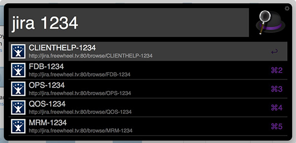

# Alfred JIRA Workflow

this workflow allows you to open JIRA ticket by inputing ticket key directly:

`Alfred > jira PROJECT-123`

It allows you to open JIRA ticket by inputing ticket number only:

`Alfred > jira 1234`

All possible tickets will be shown, and you can select any of them and open it in default browser.

The workflow does not communicate with your JIRA server, therefore you do not nees an API token.

## Installation

### Step.1 Install workflow to your Alfred

just double click file "Alfred JIRA workflow.alfredworkflow" to install it

### Step.2 Configure workflow to point to your JIRA system

You have to set following properties in the configuration window:

- **JIRA Server URL** The URL of your jira server.
- **List of Projects in JIRA** List of the projects which will be used for generating options in case you enter just a ticket number and not the ticket key.

Optionally you may chage following settings:

- **Sort projects** If checked list of projects will be sorted alphabetically otherwise projects will be listed as you ordered them during input.
- **Hotkey** The hotkey which will be used to trigger the workflow. By default it is jira.

Save it.

### Step.3 Open JIRA ticket in Alfred with keyword "jira"

done.

## Credits

Based on work of zfdang (https://github.com/zfdang/alfred-jira-workflow)
